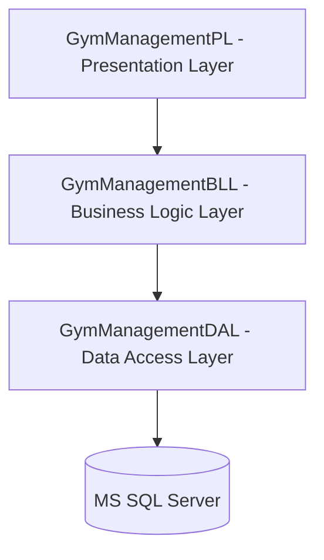

# Gym Management System

A modern, enterprise-grade Gym Management System built with **ASP.NET Core MVC** (.NET 8) following clean architecture principles. This project is structured using a **3-Tier Layered Architecture** and implements professional design patterns such as the **Repository Pattern**, **Unit of Work**, and **Service Layer** to ensure high maintainability, scalability, and clean separation of concerns.

---

## 🚀 Key Features

### 1. Authentication & Role-Based Access Control (RBAC)
*   Integrated **ASP.NET Core Identity** for secure user authentication, password hashing, and session management.
*   Implemented **Role-Based Authorization** (e.g., `SuperAdmin` role constraints for Trainer and Member CRUD operations) to protect sensitive administrative endpoints.
*   Customized authentication flows with dedicated `AccountController` for login/logout and access denial redirect handling.

### 2. Member & Health Record Management
*   Complete member lifecycle management (Create, Read, Update, Delete) with validation rules preventing duplicate emails or phone numbers.
*   **Profile Picture Uploads**: Structured attachment service to process, upload, and serve member photographs securely.
*   **One-to-One Health Profile Integration**: Mapped each member to a detailed `HealthRecord` tracking height, weight, blood type, and physical notes to customize training journeys.

### 3. Trainer & Specialization Management
*   Full trainer profile tracking, including hire dates, contact details, and specialized fitness training domains.
*   Protective deletion logic preventing the deletion of active trainers linked to scheduled future sessions.

### 4. Subscription & Plan Management
*   Dynamic membership plans with customizable prices, duration (days), and active status toggles.
*   Automatic membership state calculation (Active vs. Expired status evaluated on the fly based on current system time).
*   Prevention of multiple overlapping active memberships for the same user.

### 5. Training Sessions & Booking System
*   **Session Scheduling**: Classes scheduled with a maximum capacity, start time, end time, specific categories, and assigned trainers.
*   **Class Bookings**: Interactive booking workflow allowing members to reserve slots for upcoming sessions.
*   **Attendance Tracking**: Allows administrators/trainers to mark session attendance status (`Attended` or `Cancelled`) for members.

### 6. Admin Analytics Dashboard
*   A real-time executive dashboard calculating key performance metrics:
    *   Total and active members.
    *   Total registered trainers.
    *   Session breakdowns (Upcoming vs. Ongoing vs. Completed classes).

---

## 🏗️ Architectural Overview & Design Patterns

The project is structured into three decoupled layers:



### 1. Presentation Layer (`GymManagementPL`)
*   **ASP.NET Core MVC**: Utilizes Razor Views with clean HTML5 semantic structures and responsive styling.
*   **C# 12 Features**: Leverages modern C# enhancements such as **Primary Constructors** in controllers for clean Dependency Injection.
*   **Validation Attributes**: Implements robust client and server-side Model State Validation.

### 2. Business Logic Layer (`GymManagementBLL`)
*   **Service Layer Pattern**: Mediates between controllers and repositories, encapsulating core business rules and transaction logic.
*   **AutoMapper**: Utilizes mapping profiles to transform complex Entity models (DAL) into simplified Data Transfer Objects / ViewModels (BLL/PL), securing database schemas from direct UI exposure.
*   **Attachment Handling**: Contains file system storage management for processing profile photos.

### 3. Data Access Layer (`GymManagementDAL`)
*   **Entity Framework Core**: Code-First approach utilizing MS SQL Server.
*   **Generic Repository Pattern**: Standardizes CRUD operations via `IGenericRepository<TEntity>` to minimize boilerplate code.
*   **Unit of Work Pattern**: Implements `IUnitOfWork` to manage database transaction scopes across multiple repositories, ensuring database consistency (ACID compliance).
*   **Owned Entities**: Employs DDD concepts like `Owned` types (e.g., `Address` class embedded inside `GymUser` representing Trainer/Member details).

---

## 📊 Database Schema & Relationships

```mermaid
erDiagram
    ApplicationUser ||--|| IdentityUser : inherits
    GymUser {
        int Id
        string Name
        string Email
        string Phone
        DateOnly DateOfBirth
        Gender Gender
        Address Address
    }
    Member {
        string Photo
    }
    Trainer {
        Specialties Specialties
    }
    GymUser <|-- Member : inherits
    GymUser <|-- Trainer : inherits
    
    Member ||--|| HealthRecord : "1:1 Shared PK"
    Member ||--o{ MemberShip : "1:N"
    Plan ||--o{ MemberShip : "1:N"
    
    Category ||--o{ Session : "1:N"
    Trainer ||--o{ Session : "1:N"
    
    Session ||--o{ MemberSession : "1:N"
    Member ||--o{ MemberSession : "1:N"
```

*   **GymUser (Abstract)**: Implements base properties like Name, Email, Phone, Gender, and `Address` (Owned type consisting of `BuildingNumber`, `Street`, `City`).
*   **Member & Trainer**: Inherit properties from `GymUser`.
*   **HealthRecord**: Linked 1:1 with `Member`.
*   **MemberShip**: Joins `Member` and `Plan` (Stores Start Date, End Date, and Active status).
*   **MemberSession**: Joins `Member` and `Session` (Tracks session booking, booking dates, and attendance).

---

## 🛠️ Tech Stack & Tools

*   **Backend framework**: .NET 8 / ASP.NET Core MVC
*   **Database ORM**: Entity Framework Core 8
*   **Database Engine**: Microsoft SQL Server
*   **Authentication**: ASP.NET Core Identity (Identity Cookie Authentication)
*   **Mapping**: AutoMapper
*   **Languages**: C#, SQL, HTML5, CSS3, JavaScript

---

## ⚙️ Installation & Setup

1.  **Clone the Repository**:
    ```bash
    git clone https://github.com/your-username/GymManagementSystem.git
    cd GymManagementSystem
    ```

2.  **Configure Connection String**:
    Update the `DefaultConnection` string in [appsettings.json](file:///d:/route/MVC/GymManagementSystemSolution/GymManagementPL/appsettings.json):
    ```json
    "ConnectionStrings": {
      "DefaultConnection": "Server=YOUR_SERVER;Database=GymManagementDb;Trusted_Connection=True;MultipleActiveResultSets=true;TrustServerCertificate=True"
    }
    ```

3.  **Run the Application**:
    Start the application using Visual Studio or dotnet CLI. On startup, the program will automatically:
    *   Detect and apply pending Entity Framework migrations (`dbContext.Database.Migrate()`).
    *   Seed initial system categories and lookup data.
    *   Create default Identity Roles and SuperAdmin credentials.

### 🔑 Default Credentials (Seeded Data)
On startup, the system seeds two default users for administrative testing:
*   **SuperAdmin Role**:
    *   **Username**: `BesadaNabil`
    *   **Email**: `BesadaNabil@gmail.com`
    *   **Password**: `P@ssw0rd`
*   **Admin Role**:
    *   **Username**: `YoussefMohamed`
    *   **Email**: `YoussefMohamed@gmail.com`
    *   **Password**: `P@ssw0rd`

---

## 📝 CV / Resume Highlights for Gemini

If you want to feature this project on your CV, here are highly-optimized bullet points written in professional software engineering terminology:

*   **Designed and developed** a multi-tier Gym Management Web Application using **ASP.NET Core MVC** (.NET 8) and **Entity Framework Core**, serving as a robust administrative dashboard.
*   **Architected** a clean separation of concerns by implementing a **3-Tier Layered Architecture** (Presentation, Business Logic, and Data Access Layers) along with **Repository** and **Unit of Work** design patterns to optimize database transactions and scalability.
*   **Integrated ASP.NET Core Identity** to establish a secure authentication and authorization pipeline, configuring Role-Based Access Control (RBAC) with specific Administrative permissions.
*   **Developed** a dynamic scheduling and booking engine that manages trainer availability, session capacities, and members' subscription states in real-time.
*   **Utilized AutoMapper** to enforce clean abstraction between domain database entities and ViewModels, securing data integrity and payload structure.
*   **Engineered** automated database initialization scripts that automatically execute EF migrations and seed configuration data on application startup.
